# Byizon AI Analytics Platform

## Complete System Architecture

**Document status:** Current implementation mapped from the codebase  
**Architecture style:** Database-first, deterministic analytics, evidence-grounded AI  
**Primary stack:** React, Vite, Python, Pandas, scikit-learn, PostgreSQL, SQLite fallback, OAuth 2.0

---

## 1. Architecture Objective

Byizon converts uploaded files and connected business-system data into verified analytics, dashboards, reports, and controlled business actions.

The central architecture rule is:

> Raw data is stored and processed by the backend first. The language model receives only query-relevant, validated, structured evidence. It does not receive the complete uploaded dataset.

This design separates:

- **Calculation:** deterministic Python/Pandas code
- **Storage:** server-side database owned by a workspace
- **Reasoning context:** small, query-specific JSON
- **Explanation:** deterministic response today, with an optional LLM narrative layer
- **Actions:** permission-controlled connector operations
- **Presentation:** dashboards, charts, reports, and protected links

---

## 2. System Context

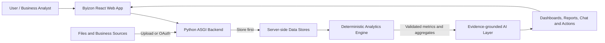

### Supported input paths

- Excel, including multiple sheets
- CSV
- JSON
- PDF text and tables
- TXT
- SQL text/export files
- SQLite/database exports
- Google Workspace resources
- Slack files and channel resources
- Generic URL-based and OAuth connector resources

---

## 3. Container Architecture

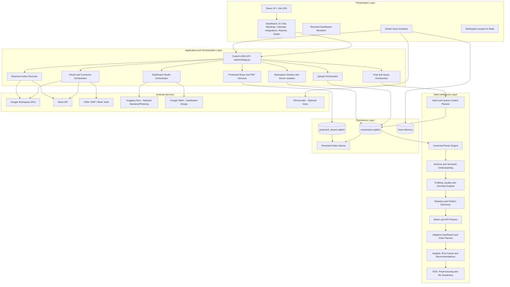

---

## 4. Database-First Upload Flow

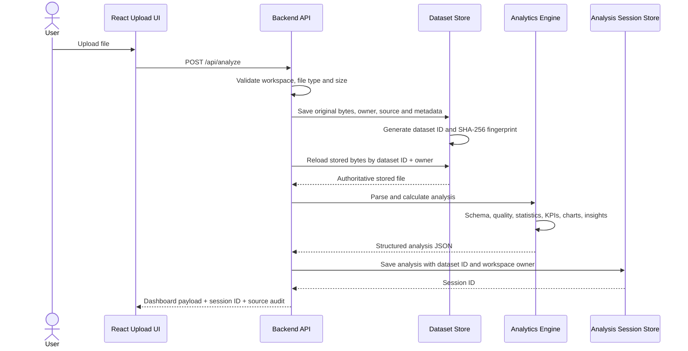

### Why this matters

- A new upload receives a new dataset ID and fingerprint.
- Analysis starts from server-stored bytes, not stale browser state.
- Every session is tied to a workspace owner.
- A later chatbot request references the saved session instead of resending the file.
- The source fingerprint can be shown as proof of which file was analyzed.

---

## 5. Analytics Processing Pipeline

```mermaid
flowchart LR
    Stored["Stored Source Bytes"]
    Parse["Parse tables/sheets"]
    Detect["Detect schema and semantics"]
    Profile["Profile quality and completeness"]
    Validate["Validate data types and values"]
    Stats["Calculate statistics"]
    KPI["Plan and calculate valid KPIs"]
    Patterns["Detect trends, outliers and relationships"]
    Plan["Plan dashboard and charts"]
    Report["Generate insights and report"]
    Persist["Persist analysis session"]

    Stored --> Parse --> Detect --> Profile --> Validate --> Stats --> KPI --> Patterns --> Plan --> Report --> Persist
```

### Engine modules

| Responsibility | Main module |
|---|---|
| Universal file parsing | `backend/analytics/file_parser.py` |
| Structural schema detection | `backend/analytics/schema_detector.py` |
| Semantic role inference | `backend/analytics/semantic_understanding_engine.py` |
| Domain confidence | `backend/analytics/domain_detector.py` |
| Completeness and profiling | `backend/analytics/data_profiler.py` |
| EDA | `backend/analytics/eda_engine.py` |
| Statistics | `backend/analytics/statistics_engine.py` |
| Anomaly grouping | `backend/analytics/anomaly_engine.py` |
| KPI selection | `backend/analytics/metric_planner.py` |
| KPI calculations | `backend/analytics/kpi_engine.py` |
| Dashboard planning | `backend/analytics/dashboard_planner.py` |
| Chart selection and data | `backend/analytics/chart_planner.py` |
| Pattern discovery | `backend/analytics/pattern_discovery_engine.py` |
| Business insights | `backend/analytics/insight_engine.py` |
| Root-cause hypotheses | `backend/analytics/root_cause_engine.py` |
| Recommendations | `backend/analytics/recommendation_engine.py` |
| Report structure | `backend/analytics/report_generator.py` |
| ML readiness/workflow | `backend/analytics/data_science_engine.py` |

---

## 6. Chatbot Query Flow

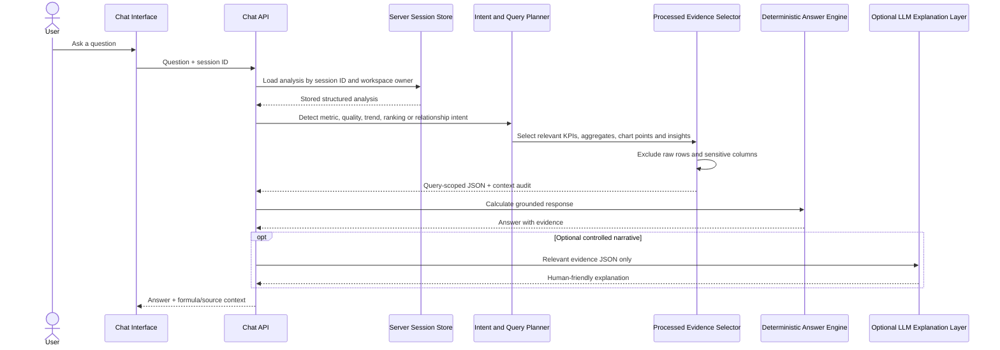

### Payload sent from the browser

The normal chatbot request contains:

- `sessionId`
- `question`
- optional interaction metadata

It does not need to resend the complete dataset.

### Query-scoped evidence

The backend context planner selects only:

- relevant KPI values
- formulas
- source columns
- a limited number of chart points
- relevant quality summaries
- selected insights and recommendations

The context audit records:

- database-first status
- whether raw rows were included
- whether the full dataset was included
- whether sensitive columns were removed
- context size
- number of selected evidence objects

### Current implementation truth

The standard analytics chatbot currently uses the deterministic Python answer engine for numerical accuracy. Hugging Face is optional for language-oriented planning and dashboard customization. This is safer for finance calculations because the LLM is not the calculator.

---

## 7. SQL Analytics Position

The application parses each source once and persists every parsed table and row in the SQL analytics warehouse. PostgreSQL ingestion uses `COPY`; local SQLite uses batched `executemany`. A deterministic dashboard is returned before advanced ML/report enrichment, which continues in a bounded background worker and updates the same analysis session. A static, parameterized query catalog calculates bounded numeric profiles, dimension counts, date coverage, and quality evidence. Pandas remains the deterministic ingestion and advanced-analysis engine; the LLM never receives the full spreadsheet and never generates SQL.

The implemented safe flow is:

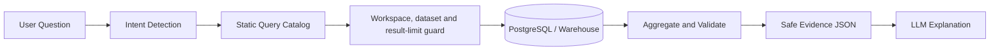

The backend selects from prebuilt query templates and binds dataset/workspace parameters. User text only ranks returned evidence by relevance. Arbitrary LLM SQL never runs against production data.

---

## 8. Connector and OAuth Flow

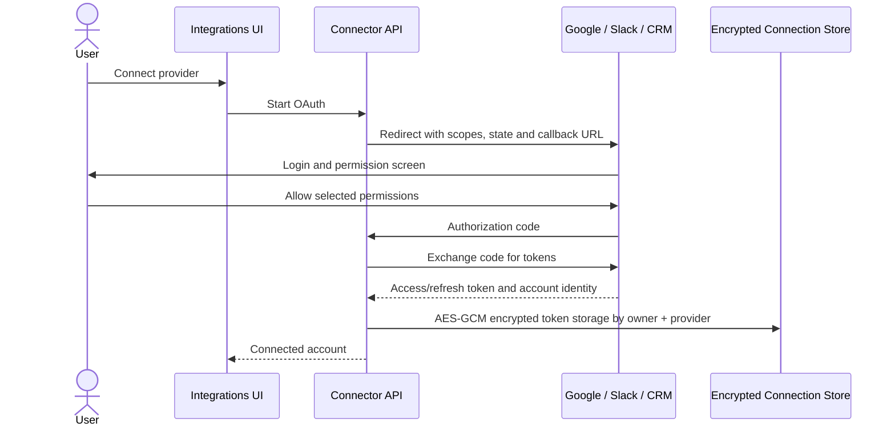

### Multi-connector behavior

Connections are stored as independent records using:

- connection ID
- connector ID
- workspace owner ID
- account metadata
- encrypted OAuth credential payload

Connecting Google must not overwrite Slack, and connecting another account must not clear earlier provider records. Resource browsing and actions always use the selected connection ID.

### Connector resource analysis

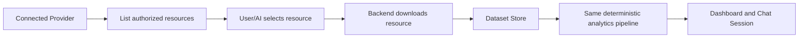

---

## 9. Text and Voice Action Flow

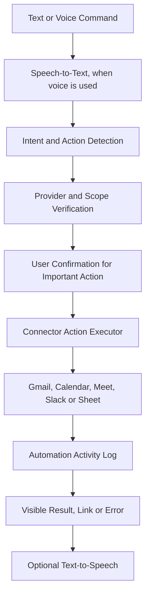

Examples:

- create a Google Calendar event with a Google Meet link
- return the generated meeting link in chat
- send the meeting link to a Slack channel
- send an email through the authorized Gmail account
- browse and analyze a Google Sheet

The provider executes the action. The LLM may understand the request, but it never fabricates a successful provider response.

---

## 10. Adaptive Dashboard Architecture

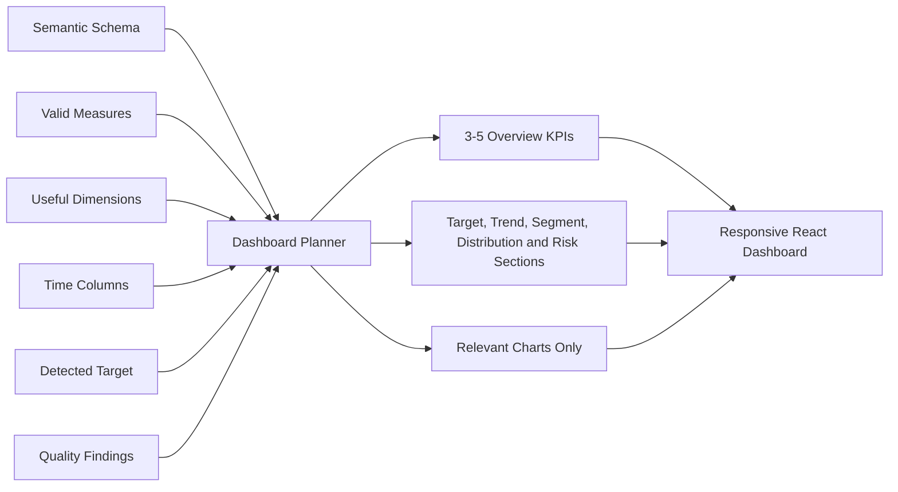

The planner skips:

- identifiers
- postal and phone codes
- encoded categories
- high-cardinality labels
- columns with insufficient usable values
- meaningless sums or averages

Each selected KPI or chart can carry:

- reason for selection
- formula
- source columns
- confidence
- analytical usefulness

---

## 11. Dashboard Studio and Stitch

Dashboard Studio receives only:

- calculated KPIs
- KPI formulas
- selected aggregated chart data
- grounded insights
- layout instructions

Raw spreadsheet rows are intentionally excluded from the Stitch request.

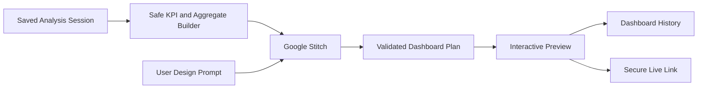

When Stitch is unavailable, a deterministic dashboard-plan fallback keeps data values grounded.

---

## 12. Reports and Secure Sharing

### Protected live dashboard

1. The backend removes raw rows, tables, chat history, and other blocked fields.
2. A random password is generated.
3. The password is hashed with bcrypt.
4. The dashboard payload is encrypted with AES-256-GCM.
5. The plain password is returned once and is never stored.
6. Access uses password verification, expiry, attempt limits, and a temporary access token.
7. A share can be revoked.

### Protected PDF

The report exporter creates a PDF from verified analysis. When password protection is selected, the exported file is encrypted before delivery.

---

## 13. Persistence Model

| Store | Purpose | Important ownership/security rule |
|---|---|---|
| `uploaded_datasets` | Original file bytes and source metadata | Dataset belongs to one workspace owner |
| `analytics_sources`, `analytics_tables`, `analytics_rows` | PostgreSQL copy of uploaded sources and all parsed rows | Every read requires dataset and workspace scope |
| `analytics_columns`, `analytics_cells` | Domain-neutral SQL representation used by the query catalog | Sensitive and identifier values are excluded from model evidence |
| `analytics_query_audit` | Hash-only question and query-catalog execution audit | Stores no raw user question or spreadsheet row |
| `analysis_sessions` | Calculated analytics and chat history | Loaded by session ID plus owner |
| `connections` | Provider connection metadata and encrypted tokens | Each provider/account is an independent record |
| `owner_aliases` | Maps temporary and authenticated workspace identities | Preserves ownership after login |
| `automation_activity` | Executed action history | Records actual provider outcomes |
| `dashboard_shares` | Encrypted protected-report payloads | Password, expiry, lock and revoke controls |
| Voice memory store | Voice interaction context | Kept separate from analytical source data |

### Current database

Production authentication and onboarding use Cloudflare D1. Local Python analytics can use an isolated SQLite fallback with the same static query contract when PostgreSQL is not configured.

### Production scale target

| Current | Production evolution |
|---|---|
| PostgreSQL analytical rows plus local compatibility stores | Encrypted object storage for large original files |
| In-process analysis | Queue-based worker jobs |
| One application instance | Horizontally scalable API and workers |
| Local key fallback | Cloud KMS and managed secrets |
| Local activity log | Immutable audit event stream |
| Session JSON | Versioned analytical result store |

---

## 14. Security Architecture

### Implemented controls

- workspace ownership validation
- server-side sessions
- OAuth state validation
- encrypted provider credentials using AES-GCM
- SHA-256 dataset fingerprints
- password-hashed protected links
- AES-GCM protected share payloads
- share expiry, failed-attempt lock, rate limit and revocation
- processed-evidence-only AI context policy
- raw rows removed from protected shares
- secrets read from server environment variables

### Recommended production controls

- PostgreSQL row-level security
- object-storage encryption with customer/workspace keys
- cloud KMS key rotation
- centralized secrets manager
- malware scanning before parsing uploads
- configurable PII detection and masking policy
- append-only audit logs
- automated backup and restore testing
- per-workspace quotas and API rate limits
- OAuth incremental consent
- explicit confirmation for send, write, delete, and share actions

---

## 15. Accuracy Architecture

Byizon cannot promise mathematical correctness by asking an LLM to calculate. Accuracy is created by system controls:

1. **Single authoritative source:** analysis reloads the server-stored file.
2. **Deterministic calculations:** Pandas and NumPy calculate metrics.
3. **Semantic guards:** IDs, codes, names, and encoded categories are not treated as measures.
4. **Transparent formulas:** KPIs retain formulas and source columns.
5. **Data validation:** missing values, duplicates, types, and outliers are profiled.
6. **Source fingerprinting:** every dataset gets a SHA-256 digest.
7. **Session isolation:** questions are answered from the selected saved session.
8. **Evidence-scoped AI:** no full raw dataset is placed in the model prompt.
9. **Graceful refusal:** unsupported metrics should report insufficient evidence.
10. **Provider verification:** actions are shown as successful only after a provider confirms them.

For finance-grade use, important totals should additionally support:

- decimal arithmetic instead of binary floating point where required
- configurable currency and rounding rules
- reconciliation against control totals
- maker-checker approval for exported or shared financial reports
- automated regression datasets with known expected outputs

---

## 16. Deployment Architecture

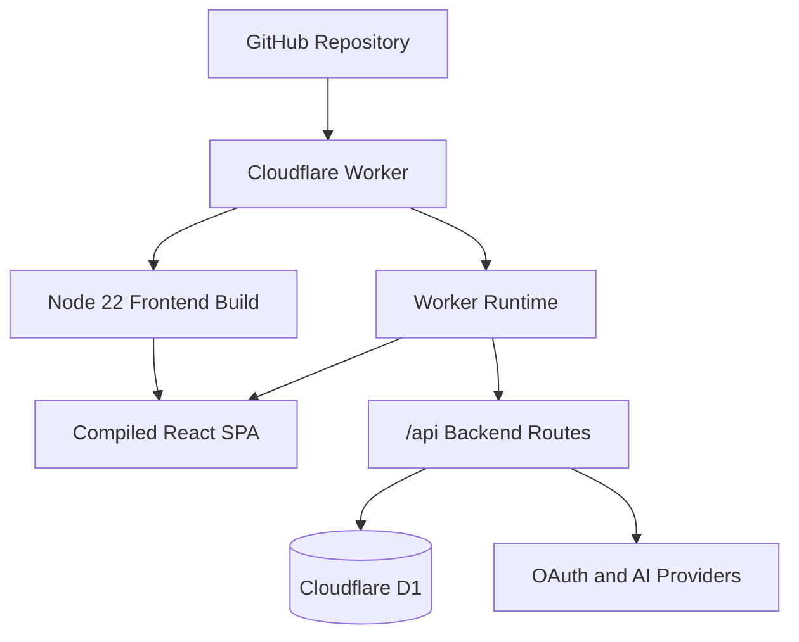

The Docker image:

1. installs frontend dependencies,
2. builds the Vite application,
3. installs Python dependencies,
4. copies the compiled frontend into the runtime image,
5. serves both the SPA and API from one public web service.

This avoids a production frontend/backend CORS split. Local development still uses:

- frontend: `http://127.0.0.1:5173`
- backend: `http://127.0.0.1:8000`

---

## 17. Environment Configuration

Only server-side environment variables should contain secrets.

### Core platform

- `BYIZON_ENV`
- `BYIZON_DATA_DIR`
- `BYIZON_SESSION_SECRET`
- `BYIZON_CONNECTOR_ENCRYPTION_KEY`
- `BYIZON_SHARE_ENCRYPTION_KEY`
- `FRONTEND_URL`
- `FRONTEND_ORIGIN`
- `OAUTH_CALLBACK_BASE`

### Google Workspace

- `GOOGLE_CLOUD_PROJECT`
- `GOOGLE_WORKSPACE_CLIENT_ID`
- `GOOGLE_WORKSPACE_CLIENT_SECRET`

### Slack

- `SLACK_CLIENT_ID`
- `SLACK_CLIENT_SECRET`
- `SLACK_SIGNING_SECRET`
- `SLACK_WEBHOOK_URL` when webhook notifications are used

### AI and dashboard design

- `HF_API_KEY`
- `HF_MODEL`
- `STITCH_API_KEY`

### Optional voice

- `ELEVENLABS_API_KEY`

No `.env` file or secret value should be committed to GitHub.

---

## 18. API Surface

| Area | Representative endpoints |
|---|---|
| Health | `GET /api/health` |
| Session | `GET /api/auth/session`, `POST /api/auth/logout` |
| Analysis | `POST /api/analyze`, `POST /api/recalculate` |
| Chat | `POST /api/chat` |
| Connectors | `GET/POST /api/connections...` |
| OAuth | `GET /api/oauth/start/{provider}`, `GET /api/oauth/callback/{provider}` |
| Sharing | `POST /api/shares`, access and revoke routes |
| Reports | export-report routes |
| Voice | config, transcribe, speak and agent routes |
| Studio | config and dashboard-plan routes |
| Activities | automation activity routes |

---

## 19. End-to-End Architecture Summary

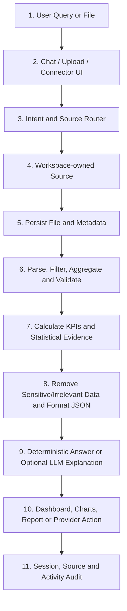

### One-line presentation explanation

> Byizon first stores and verifies the user's authorized data, calculates results with deterministic analytics, sends only relevant evidence to the AI layer, and then produces traceable dashboards, explanations, reports, and business actions.

---

## 20. Recommended Production Roadmap

### Phase 1: Demonstration-ready

- keep the current database-first upload flow
- complete end-to-end regression tests for each supported file type
- test multiple simultaneous OAuth connections
- show source fingerprint, formula, and source columns in the UI
- add explicit confirmation for outbound actions

### Phase 2: Multi-user production

- move uploaded bytes to encrypted object storage
- add job queue and worker service
- add structured audit events
- add workspace roles and permissions
- add PII classification and masking

### Phase 3: Enterprise analytics

- add read-only warehouse connectors
- extend the validated static query catalog with approved typed plans
- add semantic metric registry
- add reconciliation rules and approval workflows
- add observability for data lineage, model context, cost, and latency

### Phase 4: Governed AI automation

- provider-specific action policies
- human approval based on action risk
- reusable workflows
- scheduled refresh and anomaly monitoring
- evaluation suite for intent routing, metric accuracy, and action execution

---

## 21. Final Architecture Principle

The language model is a planner and explanation layer, not the source of truth.

The source of truth is:

1. the workspace-owned stored dataset or authorized provider,
2. deterministic calculations,
3. traceable formulas and source columns,
4. validated provider responses,
5. auditable sessions and activities.

That separation is what makes Byizon suitable for serious analytics and future finance-related use.
